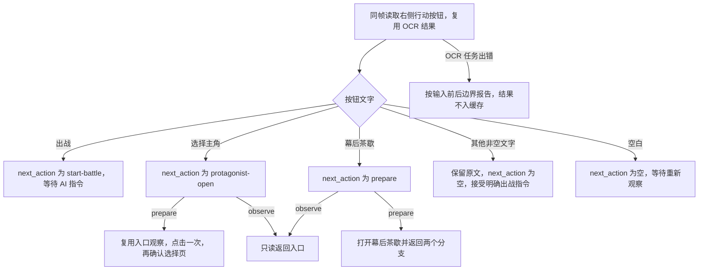

# 右侧行动按钮

已知文字与动作的对应表在 `tools/game/actions.py` 的 `BUTTON_ACTIONS`，观察返回 `button_text` 与 `next_action`。

```mermaid
flowchart TD
    Frame["同帧读取右侧行动按钮，复用 OCR 结果"] --> Text{"按钮文字"}
    Text -->|出战| Fight["next_action 为 start-battle，等待 AI 指令"]
    Text -->|选择主角| Hero["next_action 为 protagonist-open"]
    Hero -->|prepare| Open["复用入口观察，点击一次，再确认选择页"]
    Hero -->|observe| Read["只读返回入口"]
    Text -->|幕后茶歇| Tea["next_action 为 prepare"]
    Tea -->|prepare| Event["打开幕后茶歇并返回两个分支"]
    Tea -->|observe| Read
    Text -->|其他非空文字| Buff["保留原文，next_action 为空，接受明确出战指令"]
    Text -->|空白| Unknown["next_action 为空，等待重新观察"]
    Frame -->|OCR 任务出错| Error["按输入前后边界报告，结果不入缓存"]
```

换帧后重新读按钮。主角确认后仍显示「选择主角」时，继续等待确认。出战由 AI 明确指令触发。

入口识别与复用待实机验证。
