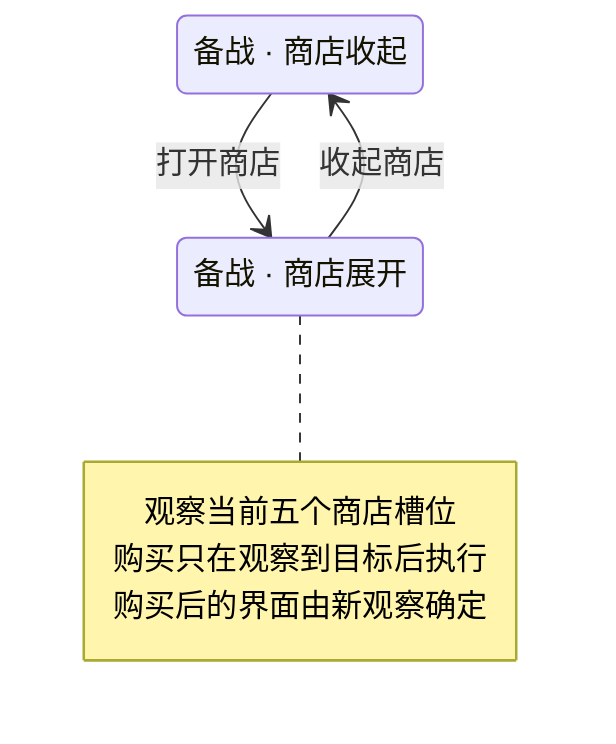

# 备战与商店状态

用户提供的截图显示商店有收起和展开两种布局，中央槽位的位置和大小随布局变化。下图仅覆盖这两种状态。商店入口的点击条件、转换完成特征和购买后的画面分支待实机确认。

```mermaid
stateDiagram-v2
    state "备战 · 商店收起" as Closed
    state "备战 · 商店展开" as Open
    Closed --> Open: 打开商店
    Open --> Closed: 收起商店
    note right of Open
        观察当前五个商店槽位
        购买只在观察到目标后执行
        购买后的界面由新观察确定
    end note
```
